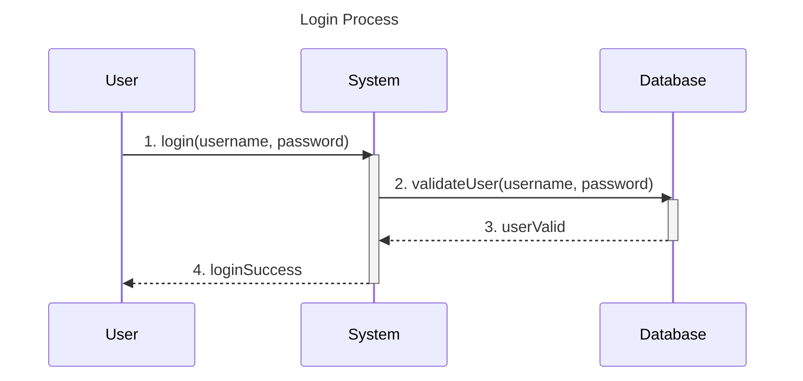

# visual-paradigm-mermaid

This is plugin for [Visual Paradigm](https://www.visual-paradigm.com/) diagramming tool which allows you to export your diagrams as [Mermaid](https://mermaid.js.org/) code.

## How to use

### Sequence Diagrams
1. Install plugin from archive
2. Open `Sequence Diagram`
3. Right click on empty space -> `Export` -> `Export diagram as Mermaid`

### ER Diagrams (NEW!)
1. Install plugin from archive
2. Open `Entity Relationship Diagram`
3. Right click on empty space -> `Export` -> `Export ER diagram as Mermaid`

## Features

### Sequence Diagram
- Lifelines, Actors
- Messages (send, return)
- Activations
- Notes
- Fragments (opt, alt, loop, parallel)

### ER Diagram (NEW!)
- Entities (tables) with attributes
- Column data types and lengths
- Primary keys (PK)
- Column descriptions as comments
- Automatic clipboard copy

## Example Outputs

### Sequence Diagram


### ER Diagram
```mermaid
erDiagram
    Customer {
        int(10) id PK
        varchar(100) name
        varchar(255) email
        date created_date
    }
    Order {
        int(10) id PK
        int(10) customer_id
        decimal(10,2) total_amount
        date order_date
    }
```

## TODO

### Sequence Diagram
- ✅ Fragments (seq, loop, alt, parallel)

### ER Diagram
- ✅ Basic entity export
- [ ] Relationship detection and export
- [ ] Foreign key detection
- [ ] Unique key detection

### Class Diagram
- [ ] Classes with attributes and methods
- [ ] Inheritance relationships
- [ ] Association relationships

### State Diagram
- [ ] States and transitions
- [ ] Initial and final states

## For Developers

Commands for development:
- Build plugin: `./gradlew build`
- Build and install plugin: `./gradlew vpInstallPlugin`

## Requirements

- Visual Paradigm 16.0 or higher
- Java 11 or higher

